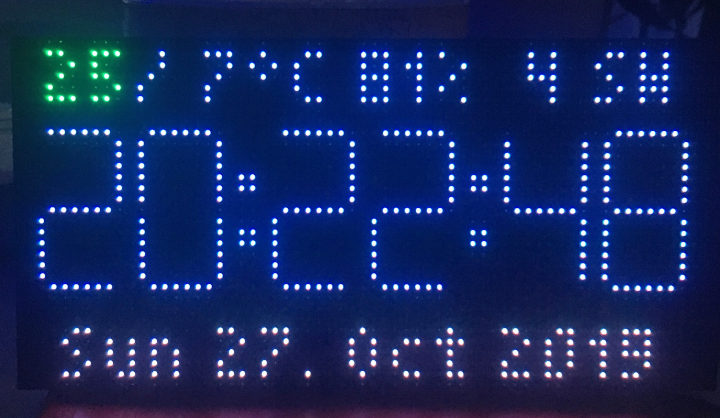
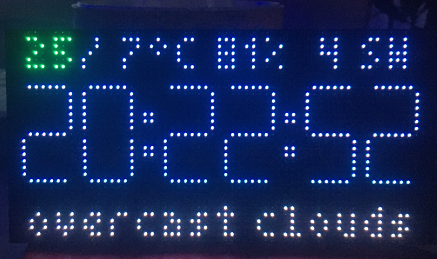

# myClock
## v0.10.4 PRE-RELEASE mod by helmarw
### Copyright 2019 by David M Denney &lt;dragondaud@gmail.com&gt;

Master repository: https://github.com/dragondaud/myClock

    

Displays accurate time, date, room temperature and current weather conditions on a 64x32 pixel display. Sets timezone automatically from geoIP, uses the ESP's native NTP for time, and accepts OTA updates. Local WebServer allows updating and configuration, including color-picker to set digits color.

Designed to run on a Wemos-D1-Mini or NodeMCU, configured for CPU Freq 160Mhz and Flash size 4M (1M SPIFFS). Known to work on D1-mini-lite, with Flash size 1M (64k SPIFFS), and now also supports ESP32. 
I recommend using a [ESP32 MH-ET LIVE D1 mini](https://ebay.us/jSmSkc) (you'll find them on ebay, aliexpess, bangood a.s.o.), ESP8266 devices didnt work work for me, i tried both of the above....

For the display i use a P4 64x32 RGB LED Matrix Display, which you can find e.g. on [ebay](https://ebay.us/l1ljDK) or [aliexpress](https://de.aliexpress.com/item/32380311346.html?spm=a2g0s.9042311.0.0.50ba4c4dh9jUXV) and elsewhere ...

Unwanted Serial output may be directed to NullStream, or on ESP32 output can be sent to Bluetooth.

Postal code is used to specify weather display location. Time Zone must be from [time zone list](https://timezonedb.com/time-zones).

Uses LDR, pulled low with a 10k resistor, on analog input to set display brightness when below threshold value set in config.

Supports display of indoor temperature with DS18B20 connected to D3 pin, pulled high with a 4K7 resistor.

Display wired following https://www.instructables.com/id/Morphing-Digital-Clock/

Easy hookup using Wemos Matrix Shield from https://github.com/hallard/WeMos-Matrix-Shield 

Compatible with MH-ET LIVE D1 mini, i ordered the Shield here: https://aisler.net/p/DRGKVMVA

Morphing digits code from https://github.com/hwiguna/HariFun_166_Morphing_Clock

Lookup TimeZone from IP using: http://ip-api.com/ (no API key required).

Lookup Offset from TimeZone using: https://timezonedb.com/ which requires an API key to use.

Get current weather data from https://openweathermap.org/api which requires an API key to use.

### Requires

Arduino IDE 1.8.9, for your platform, from https://www.arduino.cc/en/Main/Software. (works with v1.8.10 too)

Arduino core for ESP8266, version 2.5.0: https://github.com/esp8266/Arduino (same results with v2.5.2, not working for me)

or Arduino core for ESP32, from: https://github.com/espressif/arduino-esp32/releases/tag/1.0.2 (im using v1.0.4)

https://github.com/bblanchon/ArduinoJson/tree/5.x.  (im using v5.13.5, v6x is NOT working !!!)

https://github.com/adafruit/Adafruit-GFX-Library (im using v1.6.1)

https://github.com/2dom/PxMatrix (i could not get v 1.6.0 to work, so i used my own mod of the v1.3.0, PxMatrix_mod.h)

https://github.com/tzapu/WiFiManager (im using v1.0.0)

https://github.com/arcao/Syslog if rsyslog functionality desired. (it compiles with v2.0.0, but never used it, so i left it disabled)

https://github.com/milesburton/Arduino-Temperature-Control-Library if DS18B20 used (im using v3.8.0)

https://github.com/PaulStoffregen/OneWire if DS18B20 used. (im using v2.3.5 )

### Notes

Switching between ESP8266 and ESP32 platform requires deleting preferences.txt which the update script will do automatically when updating core. (Comment: did that too but still ESP8266 refused to work for me)

### Modifications/fixes

- added support for MH-ET LIVE D1 mini to PxMatrix.h v1.3.0. MH-ET LIVE D1 mini has different SPI ports than the Wemos d1 Mini (see pdf for changes). added the modifided PxMatrix.h as PxMatrix_mod.h to source
- added display of date (see pictures above)
- fixed an issue when reading temperature from DS18b20 sensor
- fixed couple of issues when in 24h display mode
- updated Readme.md

### Known Issues

- i could not get it to work with ESP8266, like Wemos D1 mini or NodeMCU 12E, after setting SSID+Password device is locked in    bootloop. Dont know what went wrong yet. I strongly recommend using an ESP32, for me the MH-ET LIVE D1 mini with WeMos-Matrix-Shield works very well!

